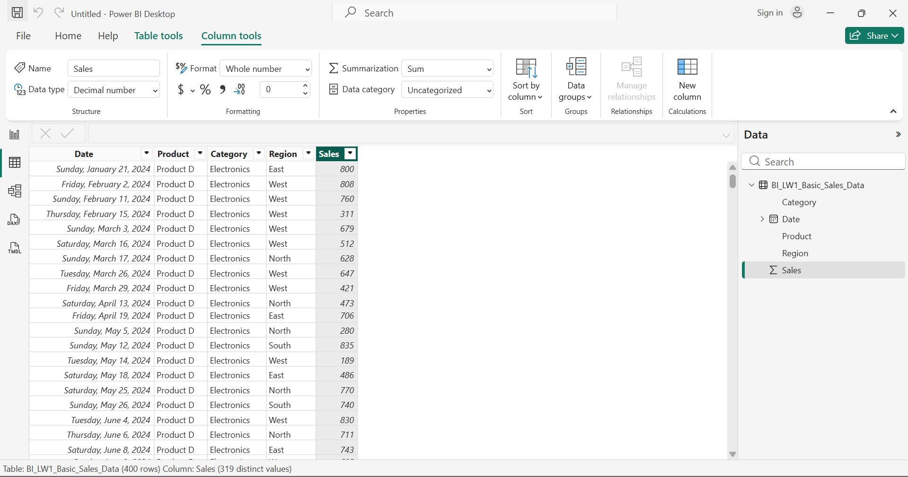
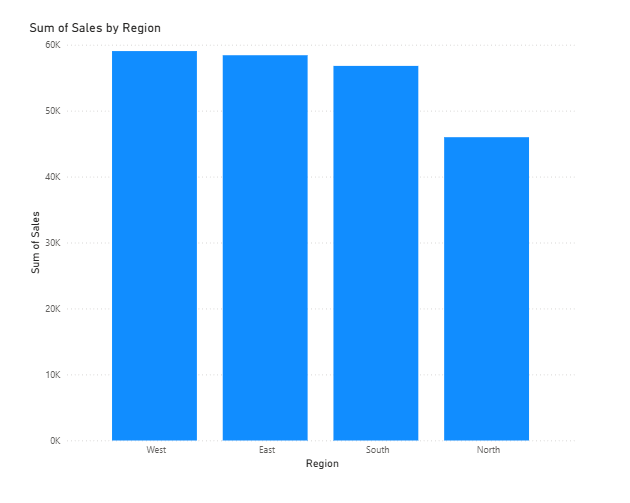
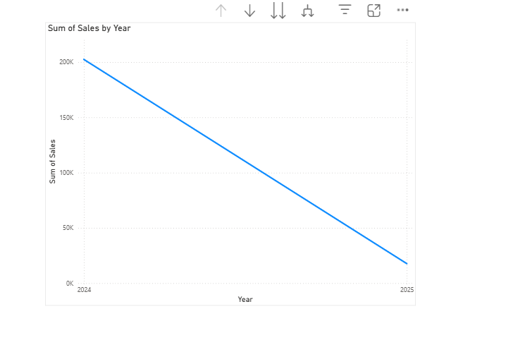
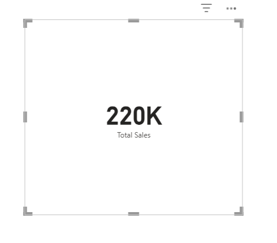

# Laboratory Work 1 - Introduction to Business Intelligence & Power BI
### Getting Started with Power BI – Loading and Exploring Data

---

## Dataset Description

**File:** `LW1_Basic_Sales_Data.csv`

| Column | Description |
|--------|-------------|
| Date | Transaction date |
| Product | Product name |
| Category | Product category |
| Region | Sales region |
| Sales | Sales amount |

---

## Part 1 – Launching Power BI & Loading Data

### Verify Data in Data View

**Q: Are all columns visible?**
> ✅ Yes. All five columns — **Date, Product, Category, Region, and Sales** — are visible in the Data View.

**Q: Is "Date" formatted as Date?**
> ✅ Yes. The **Date** column is correctly formatted as the **Date** data type.

**Q: Is "Sales" formatted as Decimal Number?**
> ⚠️ The **Sales** column was initially formatted as **Whole Number**. This was corrected by:
> 1. Clicking the **Sales** column
> 2. Going to **Column Tools**
> 3. Changing the data type to **Decimal Number**

---

## Part 3 – Creating Auto-Generated Visuals

### Step 1: Quick Visualization

.png)

**Q: What type of chart was created?**
> Power BI automatically created a **Clustered Bar/Column Chart** when the Sales field was dragged onto the canvas.

**Q: What does it show?**
> It shows the **Sum of Sales** as a single aggregated bar representing the total sales value across all records — **220K (220,000)**.

---

### Step 2: Sales by Region Chart

> A **Clustered Column Chart** was created by:
> - Selecting **Clustered Column Chart** from the Visualizations pane
> - Dragging **Region** → X-axis
> - Dragging **Sales** → Values

**Q: Which region has the highest sales?**
> The **West** region has the highest total sales at approximately **59K**, followed by East (~58K), South (~57K), and North (~46K).

---

### Step 3: Sales by Category

> A **Pie Chart** was created by:
> - Inserting a **Pie Chart** from the Visualizations pane
> - Dragging **Category** → Legend
> - Dragging **Sales** → Values

**Q: Which category dominates?**
> **Electronics** dominates with **90K (40.82%)** of total sales — the highest among all three categories.

**Q: Is the distribution balanced?**
> The distribution is **not perfectly balanced**. Electronics and Furniture are relatively close (40.82% vs 39.19%), but Office Supplies significantly trails at only **19.99%**. The split is roughly **40/40/20**, showing a clear gap between the top two categories and Office Supplies.

---

### Step 4: Sales Over Time

> A **Line Chart** was created by:
> - Inserting a **Line Chart** from the Visualizations pane
> - Dragging **Date** → X-axis
> - Dragging **Sales** → Values

**Q: Is there growth?**
> **No.** The line chart shows a **declining trend** from 2024 to 2025 rather than growth.

**Q: Any noticeable trend?**
> There is a **steep downward slope** from approximately **200K in 2024** down to near **0 in 2025**. 

---

## Part 4 – Basic Data Insight Interpretation

**Q: Which region contributes most revenue?**
> The **West region** contributes the most revenue with approximately **59K** in total sales, making it the top-performing region.

**Q: Which product category performs best?**
> **Electronics** performs best, contributing **90K (40.82%)** of total sales — the highest share among all three product categories.

**Q: Are sales consistent across dates?**
> Sales are **not fully consistent across dates**. The 2024 data shows significantly higher recorded sales (~200K) compared to 2025. 

**Q: What business recommendation can you suggest?**
> Management should **focus resources on the West and East regions** where sales are strongest, while launching targeted campaigns to **improve the North region's performance** (lowest at ~46K). For products, **Office Supplies needs increased attention** as it significantly underperforms at only 19.99% compared to Electronics and Furniture.

---

## Laboratory Questions Part A & B

### Part A – Technical Questions

**1. What are the five columns in the dataset?**
> The five columns are: **Date, Product, Category, Region, and Sales**.

**2. What data type is assigned to the "Sales" column?**
> The Sales column was initially set to **Whole Number** but was corrected to **Decimal Number** using Column Tools in Power BI.

**3. Which Power BI view allows you to see raw data?**
> The **Data View** (represented by the table icon on the left sidebar) allows users to see and inspect raw data.

**4. What chart type is best for showing trends over time?**
> A **Line Chart** is best for showing trends over time, as it clearly visualizes how a value increases, decreases, or remains stable across a time period.

**5. What aggregation is automatically applied to Sales?**
> Power BI automatically applies **Sum** aggregation to the Sales field, displaying the total sum of all sales values.

---

### Part B – Analytical Questions

**6. Which region has the highest total sales?**
> The **West region** has the highest total sales at approximately **59K**.

**7. Which category has the lowest performance?**
> **Office Supplies** has the lowest performance at **44K (19.99%)** of total sales — significantly lower than Electronics (40.82%) and Furniture (39.19%).

**8. Are sales increasing, decreasing, or stable?**
> Sales appear to be **decreasing** from 2024 to 2025 based on the line chart. 

**9. If you were a manager, which region would you prioritize?**
> As a manager, I would prioritize the **North region** — it significantly underperforms at ~46K compared to the other regions (56K–59K). Investigating the root cause and launching a targeted recovery strategy in the North offers the greatest opportunity for overall revenue growth.

**10. Provide one actionable recommendation based on the data.**
> **Launch a targeted sales and marketing campaign in the North region with a focus on Office Supplies.** Since the North is the weakest region and Office Supplies is the weakest category, combining efforts here addresses two underperforming segments simultaneously. Bundling Office Supplies with popular Electronics products, offering regional promotions, or increasing sales staffing in the North could effectively lift performance in both areas.

---

## Enhancement Section

### Task 1: Add a Card Visualization

> A **Card Visualization** was added by:
> 1. Inserting a **Card** from the Visualizations pane
> 2. Dragging **Sales** into the field
> 3. Formatting: increased font size and changed the title to **"Total Sales"**

**Q: What is the total sales amount?**
> The total sales amount is **220K (220,000)**.

---

### Task 2: Add Slicer

> A **Region Slicer** was added by:
> 1. Inserting a **Slicer** from the Visualizations pane
> 2. Dragging **Region** into the field
> 3. Testing by clicking each region to observe filtering behavior

**Q: What happens to other visuals when you click a region?**
> All other visuals on the dashboard **automatically filter and update** to only display data for the selected region. For example, when **"South"** is selected:
> - Total Sales card changes from **220K → 57K**
> - The bar chart shows only the South bar
> - The pie chart updates to South's category breakdown (Electronics 45.21%, Furniture 36.99%, Office Supplies 17.79%)
> - The line chart updates to show only South's sales trend

**Q: Why is filtering important in BI?**
> Filtering is critical in Business Intelligence because it allows users to **drill down into specific segments of data** without needing to create separate reports for each scenario. It enables **dynamic, real-time analysis** — allowing managers and decision-makers to quickly isolate and compare performance by region, time period, category, or any other dimension. This leads to faster and more accurate business decisions.

---

### Task 3: Sort Sales

> The Region chart was sorted by:
> 1. Clicking the **Region Chart**
> 2. Clicking the **three dots (...)** on the top right of the visual
> 3. Selecting **Sort by Sales → Descending**

**Q: Does sorting improve readability?**
> **Yes**, sorting by Sales Descending immediately makes it clear which region leads and which trails, without requiring the viewer to scan and mentally compare bar heights.

**Q: Why?**
> Sorted charts follow a **natural visual hierarchy** from highest to lowest value, which significantly reduces cognitive effort for the viewer. It allows the reader to instantly identify rankings and performance gaps between regions, making the chart far more useful for presentations, reports, and business decision-making.

---

### Task 4: Identify Outliers

**Q: Which region is significantly higher or lower?**
> The **North region** stands out as significantly lower at approximately **46K**, while the other three regions (West ~59K, East ~58K, South ~57K) are all clustered closely together. The **West region** has the highest region.

**Q: What might explain that difference?**
> Possible explanations for North's underperformance include:
> - Lower population density or smaller market size in the North
> - Fewer sales representatives or distribution channels assigned to the region
> - Less marketing investment or brand awareness compared to other regions
> - Seasonal demand differences that uniquely affect the North
> - Logistical or supply chain challenges affecting product availability in that region

---

## One-Page Insight Summary

### 📊 Business Intelligence Insights – LW1 Sales Data Analysis

**Total Sales: 220,000 | Regions: 4 | Categories: 3 | Period: 2024–2025**

---

**Insight 1 – West Region is the Top Revenue Contributor**
The West region leads all regions with approximately 59K in total sales, closely followed by East (58K) and South (57K). North significantly lags at 46K — a gap of ~12K below the next lowest region. The top three regions perform similarly, suggesting consistent market strength, while North requires urgent strategic attention.

---

**Insight 2 – Electronics Dominates the Product Mix**
Electronics accounts for 40.82% (90K) of total sales, making it the strongest performing category. Furniture follows closely at 39.19% (86K). Office Supplies trails far behind at only 19.99% (44K) — less than half of Electronics — indicating either lower demand or insufficient promotional effort for this category.

---

**Insight 3 – Sales Trend Appears Declining but Data May Be Incomplete**
The line chart shows a steep downward trend from ~200K in 2024 to near zero in 2025. 

---

**Insight 4 – Regional Filtering Reveals Unique Product Preferences**
When the dashboard is filtered to the South region (57K total), Electronics accounts for 45.2% — notably higher than the overall average of 40.82%. This suggests that Electronics demand is even stronger in the South, which can guide region-specific inventory decisions and targeted marketing strategies.

---

**Insight 5 – North Region is a Clear Underperformer**
At only 46K, the North region consistently underperforms across all metrics. This represents the single largest revenue gap among all regions and is the biggest opportunity for growth. A dedicated recovery plan including increased sales staffing, targeted promotions, and improved distribution channels could meaningfully close this gap.

---

### Key Recommendations
1. **Prioritize the West and East regions** for continued investment as they deliver the highest returns.
2. **Develop a targeted recovery plan for the North region** — investigate root causes and launch region-specific campaigns.
3. **Boost Office Supplies performance** through bundling, promotions, or improved placement across all regions.
4. **Collect complete 2025 data** before making any year-over-year performance judgments.
5. **Use Power BI slicers for monthly regional reviews** to catch performance dips early and enable faster responses.

---

*Submitted by: [Dianah Myra Salazar]*
